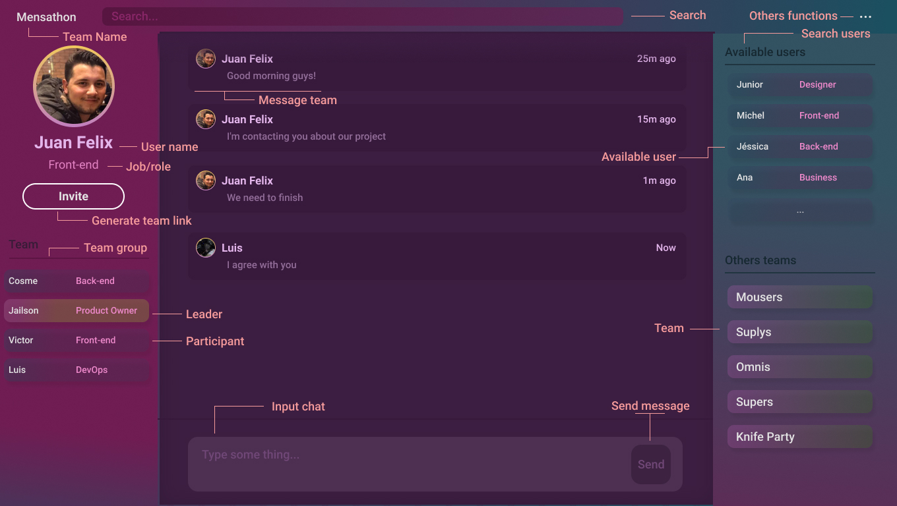

<h1 align="center">

</h1>
<h3 align="center">
A simple solution for people-to-people connections at Hackathon events 🥇
</h3>

## Overview

The **Mensathon** project was created with a focus on solving people connections at Hackathons events, specializing in user search solution by role/job type and even filtering people with specific tags involving technology, software and to favorite IDE.

## Features

- Search people by role/job
- Tag search method
- Simplified teaming method
- Team chat
- Control of people by role/job

## Screenshot

## License

MIT © Mensathon
